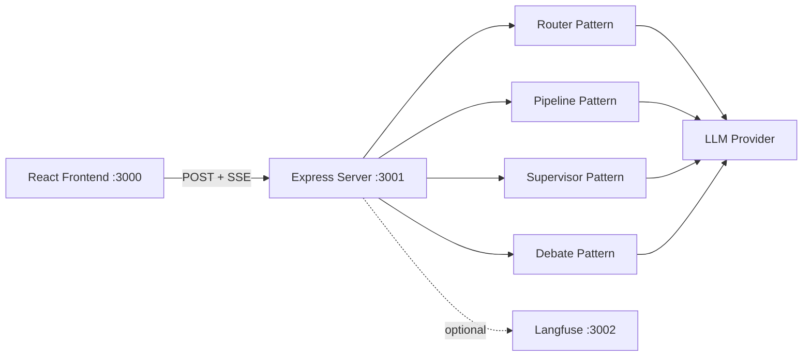

# Agent Orchestration Patterns

Educational project demonstrating 4 multi-agent orchestration patterns with real-time streaming, inline trace visualization, and LLM-as-judge evals.

## Architecture



## Quick Start

```bash
git clone https://github.com/your-org/agent-orchestration-patterns.git
cd agent-orchestration-patterns

cp .env.example .env
# Edit .env — set your LLM_API_KEY and LLM_PROVIDER/LLM_MODEL

npm install
npm run dev
```

Open http://localhost:3000, select a pattern, and send a message.

### Environment Variables

| Variable | Required | Example |
|----------|----------|---------|
| `LLM_PROVIDER` | Yes | `anthropic`, `openai`, or `google` |
| `LLM_MODEL` | Yes | `claude-sonnet-4-20250514`, `gpt-4o-mini` |
| `ANTHROPIC_API_KEY` | If using Anthropic | `sk-ant-...` |
| `OPENAI_API_KEY` | If using OpenAI | `sk-...` |
| `GOOGLE_GENERATIVE_AI_API_KEY` | If using Google | `...` |
| `LANGFUSE_SECRET_KEY` | No | `sk-lf-...` |
| `LANGFUSE_PUBLIC_KEY` | No | `pk-lf-...` |
| `LANGFUSE_BASEURL` | No | `http://localhost:3002` |

## Patterns

| Pattern | Description | When to Use |
|---------|-------------|-------------|
| **[Router](patterns/router/)** | Classifies intent, routes to specialist agent | Customer support, help desks, any input-dependent dispatch |
| **[Pipeline](patterns/pipeline/)** | Sequential chain: researcher -> writer -> editor | Content creation, data processing, multi-step transforms |
| **[Supervisor](patterns/supervisor/)** | Plans subtasks, dispatches workers, reviews quality with retry | Research tasks, complex queries needing quality assurance |
| **[Debate](patterns/debate/)** | Adversarial bull/bear arguments judged by neutral agent | Investment analysis, decision-making, exploring both sides |

## Docker

```bash
# Server + frontend
docker compose up

# With Langfuse for evals (adds Langfuse + Postgres)
docker compose --profile langfuse up
```

| Service | URL |
|---------|-----|
| Frontend | http://localhost:3000 |
| Server API | http://localhost:3001 |
| Langfuse | http://localhost:3002 (langfuse profile only) |

## Tech Stack

- **TypeScript** with npm workspaces (monorepo)
- **Vercel AI SDK** (`@ai-sdk/anthropic`, `@ai-sdk/openai`, `@ai-sdk/google`) for provider-agnostic LLM
- **Express** with Server-Sent Events (SSE) for real-time streaming
- **React 19** + Vite + Tailwind CSS v4 (dark theme)
- **Langfuse** (optional) for eval datasets, LLM-as-judge scoring, cost tracking
- **Docker Compose** for containerized deployment

## Project Structure

```
agent-orchestration-patterns/
├── packages/core/       # LLM provider, BaseAgent, stream types, eval utilities
├── server/              # Express server, SSE streaming, pattern + eval routes
├── frontend/            # React app — chat panel + live trace visualization
├── patterns/
│   ├── router/          # Intent classification -> specialist dispatch
│   ├── pipeline/        # Sequential stage chain (research -> write -> edit)
│   ├── supervisor/      # Plan -> dispatch -> review -> retry loop
│   └── debate/          # Multi-round bull/bear debate + judge verdict
├── docs/                # Architecture docs, implementation guides
└── docker-compose.yml
```

## API

```
GET  /api/patterns              # List available patterns
POST /api/patterns/:name/run    # Run a pattern (SSE stream response)
POST /api/evals/:name/run       # Run eval dataset against a pattern
GET  /api/health                # Health check
```

### SSE Event Types

All pattern runs stream events via SSE:

| Event | Description |
|-------|-------------|
| `agent_start` | Agent begins processing (name + role) |
| `chunk` | Streaming text content from an agent |
| `handoff` | Control passes between agents (from, to, reason) |
| `agent_end` | Agent finished (duration + token usage) |
| `error` | Agent-level error |
| `done` | Pattern run complete (total token usage) |

## Commands

```bash
npm run dev              # Start server + frontend concurrently
npm run dev:server       # Server only (:3001)
npm run dev:frontend     # Frontend only (:3000)
npm run typecheck        # TypeScript check all workspaces
npm run test             # Run all tests (vitest)
```

## Workspace Boundaries

```
packages/core/   -> imports nothing from other workspaces
server/          -> imports from core + patterns
patterns/*/      -> imports from core only
frontend/        -> type-only imports from core (no runtime imports)
```
