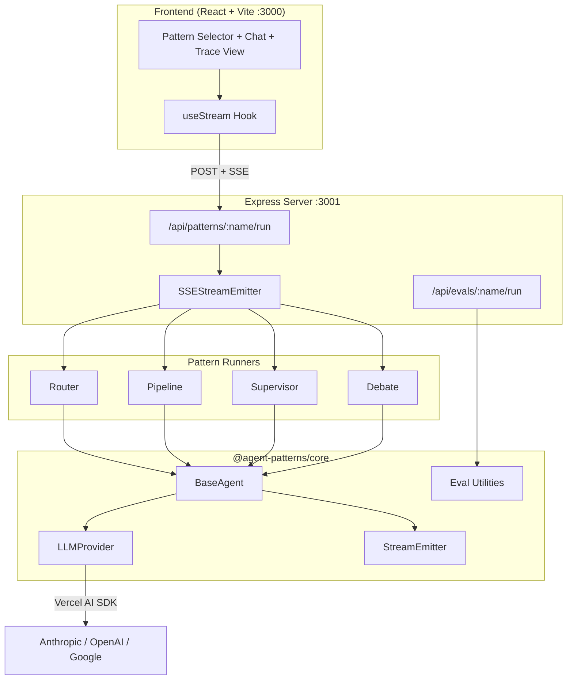
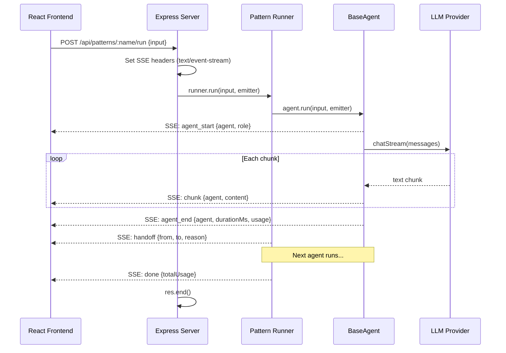
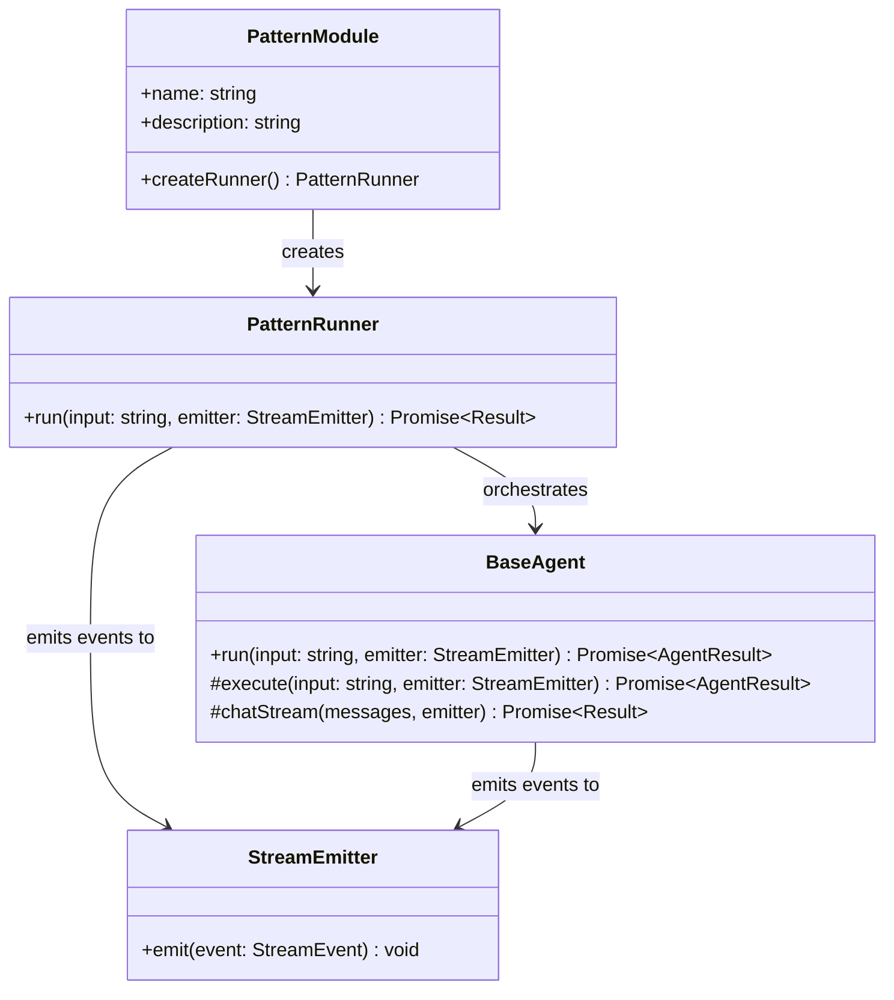
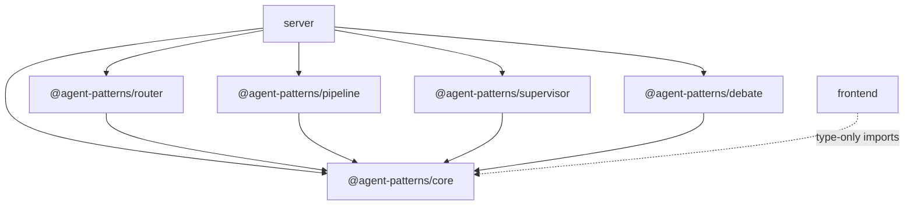
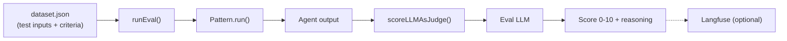

# Architecture

## System Overview



## Streaming Flow

Every pattern run follows the same SSE streaming protocol. The server wraps an Express response in an `SSEStreamEmitter`, which agents use to emit events as they execute.



### Event Types

```
agent_start  -> An agent begins processing
chunk        -> Streaming text content from an agent
handoff      -> Control transfers between agents
agent_end    -> Agent finished (includes duration + token usage)
error        -> Agent-level error occurred
done         -> Pattern run complete (includes total token usage)
```

Events are JSON-encoded and sent as SSE `data:` lines:

```
data: {"type":"agent_start","agent":"router","role":"classifier"}

data: {"type":"chunk","agent":"router","content":"BILLING"}

data: {"type":"agent_end","agent":"router","durationMs":342,"usage":{"inputTokens":85,"outputTokens":1}}

data: {"type":"handoff","from":"router","to":"billing","reason":"billing intent detected"}

data: {"type":"done","totalUsage":{"inputTokens":230,"outputTokens":145}}
```

## Pattern Interface

Every pattern exports the same shape. The server dynamically imports all four at startup.



## Workspace Dependencies



Strict boundaries: `packages/core` imports nothing from other workspaces. The frontend only uses type-only imports from core (no runtime dependencies). Patterns depend exclusively on core.

## LLM Provider Layer

The `LLMProvider` class wraps Vercel AI SDK behind a stable internal API. It supports three providers via `createProvider()`:

| Provider | Package | Example Model |
|----------|---------|---------------|
| `anthropic` | `@ai-sdk/anthropic` | `claude-sonnet-4-20250514` |
| `openai` | `@ai-sdk/openai` | `gpt-4o-mini` |
| `google` | `@ai-sdk/google` | `gemini-2.0-flash` |

Two methods: `chat()` for single-shot responses (used by supervisor planning/review), and `chatStream()` for streaming (used by all agent `execute()` calls via `BaseAgent.chatStream()`).

## Eval System

The eval system runs pattern test datasets and scores outputs using LLM-as-judge.



- Each pattern has an `eval/dataset.json` with test inputs and expected behaviors
- `POST /api/evals/:name/run` runs the full dataset and returns scored results
- Langfuse integration is optional -- if `LANGFUSE_*` env vars are missing, logging is skipped
- Eval uses a separate `EVAL_MODEL` env var (defaults to `gpt-4o-mini`)

## Frontend Architecture

The React app uses a single `useStream` hook to manage all SSE state. The hook connects to the server, parses SSE events, and reduces them into chat messages and trace graph data.

| Component | Role |
|-----------|------|
| `PatternSelector` | Dropdown to pick which pattern to run |
| `Chat` | Message list with agent name/role badges + input box |
| `TraceView` | Live trace visualization -- agents as nodes, handoffs as edges |
| `useStream` | SSE hook -- parses events, maintains messages + trace state |

The chat panel and trace panel update simultaneously as events stream in. The trace view builds a live graph showing agent execution flow with status indicators, token counts, and latency.
