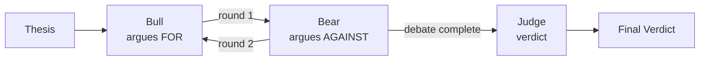

# Debate Pattern

Two debater agents argue opposing sides of a thesis over multiple rounds, then a judge agent evaluates the arguments and delivers a verdict. Implements an investment analysis scenario with bull (for) and bear (against) debaters.

## When to Use

- **Investment analysis**: Weigh arguments for and against an investment thesis
- **Decision-making**: Surface pros and cons before committing to a course of action
- **Critical thinking**: Force exploration of opposing viewpoints on any topic

## Architecture



## How It Works

1. The **bull debater** presents arguments in favor of the thesis
2. The **bear debater** counters with arguments against
3. This repeats for 2 rounds (configurable), with each debater seeing the full transcript so far
4. After all rounds, the **judge** receives the complete debate transcript and delivers a verdict with reasoning

### Event Flow

```
agent_start  {agent: "bull", role: "debater"}
chunk        {agent: "bull", content: "...arguments for..."}
agent_end    {agent: "bull", ...}
handoff      {from: "bull", to: "bear", reason: "round 1"}
agent_start  {agent: "bear", role: "debater"}
chunk        {agent: "bear", content: "...arguments against..."}
agent_end    {agent: "bear", ...}
handoff      {from: "bear", to: "bull", reason: "next round"}
agent_start  {agent: "bull", role: "debater"}
chunk        {agent: "bull", content: "...rebuttal for..."}
agent_end    {agent: "bull", ...}
handoff      {from: "bull", to: "bear", reason: "round 2"}
agent_start  {agent: "bear", role: "debater"}
chunk        {agent: "bear", content: "...rebuttal against..."}
agent_end    {agent: "bear", ...}
handoff      {from: "bear", to: "judge", reason: "debate complete"}
agent_start  {agent: "judge", role: "judge"}
chunk        {agent: "judge", content: "...verdict and reasoning..."}
agent_end    {agent: "judge", ...}
done         {totalUsage: {...}}
```

## Agents

| Agent | Role | Purpose |
|-------|------|---------|
| `bull` | debater | Argues in favor of the thesis |
| `bear` | debater | Argues against the thesis |
| `judge` | judge | Evaluates all arguments, declares a winner with reasoning |

## Tradeoffs

- **Balanced analysis**: Forces exploration of both sides, reducing one-sided bias
- **Structured output**: The judge synthesizes a clear verdict from opposing arguments
- **Engaging**: The debate format produces readable, well-argued content
- **High token usage**: Each debater sees the growing transcript; costs scale with round count
- **Fixed sides**: Bull is always "for", bear is always "against" -- no nuanced positioning
- **Judge quality**: The verdict is only as good as the judge's ability to weigh arguments
