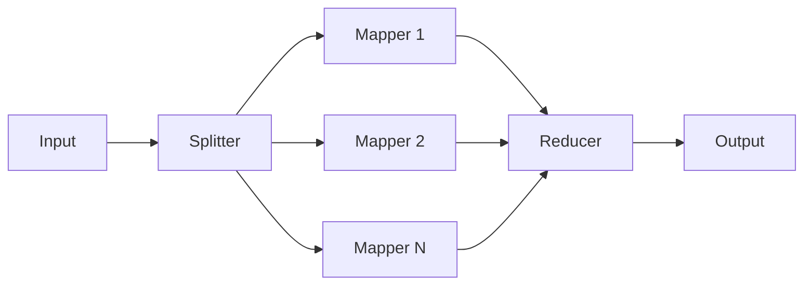

# Map-Reduce Pattern

Parallel fan-out to independent mapper agents with merged reduction into a single coherent response.

## How It Works

## Flow

1. **Split** -- The SplitterAgent breaks the input into 2-4 independent sub-tasks using non-streaming `provider.chat()`
2. **Fan-out** -- One handoff event per mapper is emitted
3. **Map** -- All MapperAgents run concurrently via `Promise.all()`, each streaming its analysis
4. **Fan-in** -- A single handoff event signals all mappers are done
5. **Reduce** -- The ReducerAgent synthesizes all mapper outputs into one coherent response

## Parallelism

Mappers run in parallel using `Promise.all()`. Each mapper gets its own `LLMProvider` instance because `lastUsage` is instance state on LLMProvider and would race if shared across concurrent streams. Events from different mappers interleave on the stream -- the frontend uses the `agent` field to attribute chunks to the correct mapper.

## Agent Roles

| Agent | Role | Streaming | Description |
|-------|------|-----------|-------------|
| SplitterAgent | splitter | No (chat) | Breaks input into independent sub-tasks |
| MapperAgent | mapper | Yes (chatStream) | Analyzes a single sub-task in detail |
| ReducerAgent | reducer | Yes (chatStream) | Synthesizes all analyses into one response |
