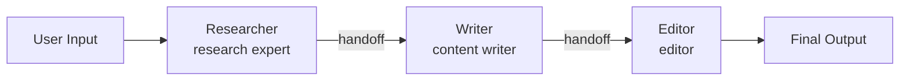

# Pipeline Pattern

A sequential chain of agents where each stage's output becomes the next stage's input. Implements a content creation workflow: research, write, then edit.

## When to Use

- **Content creation**: Research a topic, draft an article, polish the final version
- **Data processing**: Extract, transform, load pipelines with LLM agents at each step
- **Multi-step transforms**: Any workflow where each step refines the previous output

## Architecture



## How It Works

1. **Researcher** gathers information and context about the user's topic
2. Output passes to the **Writer**, who drafts structured content based on the research
3. Output passes to the **Editor**, who refines for clarity, grammar, and coherence
4. The editor's output is the final result

Each stage emits its own `agent_start`, `chunk`, and `agent_end` events. Between stages, a `handoff` event signals the transition.

### Event Flow

```
agent_start  {agent: "researcher", role: "research expert"}
chunk        {agent: "researcher", content: "...research findings..."}
agent_end    {agent: "researcher", ...}
handoff      {from: "researcher", to: "writer", reason: "passing to next stage"}
agent_start  {agent: "writer", role: "content writer"}
chunk        {agent: "writer", content: "...draft article..."}
agent_end    {agent: "writer", ...}
handoff      {from: "writer", to: "editor", reason: "passing to next stage"}
agent_start  {agent: "editor", role: "editor"}
chunk        {agent: "editor", content: "...polished article..."}
agent_end    {agent: "editor", ...}
done         {totalUsage: {...}}
```

## Stages

| Stage | Role | Purpose |
|-------|------|---------|
| `researcher` | research expert | Gathers facts, data, and context |
| `writer` | content writer | Drafts structured content from research |
| `editor` | editor | Polishes for clarity, grammar, coherence |

## Tradeoffs

- **Predictable**: Fixed execution order, easy to reason about
- **Composable**: Add or remove stages by editing the pipeline array
- **Cumulative quality**: Each stage builds on the previous, improving output
- **No parallelism**: Stages run sequentially; total latency is the sum of all stages
- **No feedback**: A later stage cannot ask an earlier stage to redo its work
- **Context growth**: Each stage receives the full output of the previous stage, which can grow large
