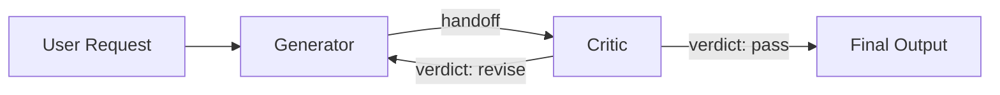

# Reflection Pattern

A generator agent produces content, a critic agent evaluates it with a structured verdict, and the generator revises based on feedback. The loop repeats until the critic passes or a maximum iteration limit is reached. The only pattern in this collection featuring iterative self-improvement with conditional early exit.

## When to Use

- **Content refinement**: Producing high-quality writing through structured critique
- **Iterative improvement**: Any task where output quality benefits from review cycles
- **Quality gates**: Ensuring output meets specific criteria before acceptance

## Architecture



## How It Works

1. The **generator** produces initial content from the user's request
2. The **critic** evaluates against criteria (coherence, evidence, persuasiveness, clarity, completeness) and returns a JSON verdict: `pass` or `revise` with feedback
3. If `revise`: the generator receives the original request, its previous draft, and the feedback, then produces a revised version
4. The loop repeats until `pass` or max iterations (3) are reached
5. On the final iteration, the critic is skipped — the generator's output is the final answer

### Event Flow (2 iterations, pass on second review)

```
agent_start  {agent: "generator", role: "content generator"}
chunk        {agent: "generator", content: "...initial draft..."}
agent_end    {agent: "generator", ...}
handoff      {from: "generator", to: "critic", reason: "iteration 1 — reviewing"}
agent_start  {agent: "critic", role: "content critic"}
chunk        {agent: "critic", content: "...evaluation...{verdict: revise}"}
agent_end    {agent: "critic", ...}
handoff      {from: "critic", to: "generator", reason: "revision needed: ..."}
agent_start  {agent: "generator", role: "content generator"}
chunk        {agent: "generator", content: "...revised draft..."}
agent_end    {agent: "generator", ...}
handoff      {from: "generator", to: "critic", reason: "iteration 2 — reviewing"}
agent_start  {agent: "critic", role: "content critic"}
chunk        {agent: "critic", content: "...evaluation...{verdict: pass}"}
agent_end    {agent: "critic", ...}
done         {totalUsage: {...}}
```

## Agents

| Agent | Role | Purpose |
|-------|------|---------|
| `generator` | content generator | Produces and revises content based on feedback |
| `critic` | content critic | Evaluates quality, returns structured pass/revise verdict |

## Tradeoffs

- **Quality improvement**: Each iteration measurably improves output specificity and evidence
- **Conditional exit**: Stops early when quality is sufficient, saving tokens
- **Structured feedback**: Critic provides actionable, parseable verdicts (not just prose)
- **Token cost**: Scales linearly with iterations — worst case is 3 generator + 2 critic calls
- **Diminishing returns**: Third revision rarely adds as much value as the first
- **Critic reliability**: Verdict parsing has fallback handling for malformed JSON
