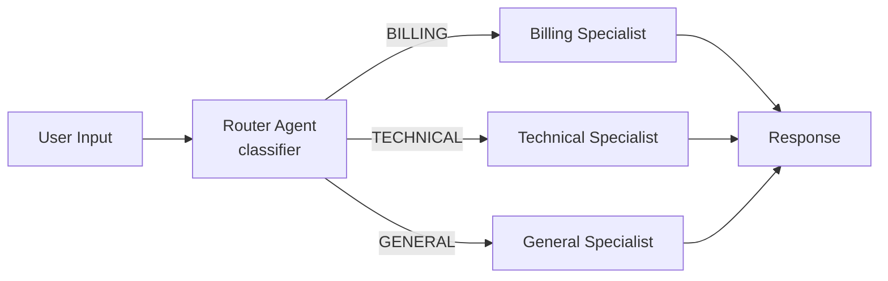

# Router Pattern

A classifier agent examines the user's input, determines intent, and routes to the appropriate specialist agent. Each specialist handles a specific domain with tailored system prompts.

## When to Use

- **Customer support**: Route tickets to billing, technical, or general support
- **Help desks**: Dispatch queries to the right team based on topic
- **Any scenario** where the response strategy depends on input classification

## Architecture



## How It Works

1. **Router agent** receives the user's message and classifies intent into one of three categories: `BILLING`, `TECHNICAL`, or `GENERAL`
2. A **handoff event** is emitted indicating which specialist was selected and why
3. The matched **specialist agent** processes the original input with domain-specific expertise
4. The specialist's streamed response becomes the final output

### Event Flow

```
agent_start  {agent: "router", role: "classifier"}
chunk        {agent: "router", content: "BILLING"}
agent_end    {agent: "router", ...}
handoff      {from: "router", to: "billing", reason: "billing intent detected"}
agent_start  {agent: "billing", role: "specialist"}
chunk        {agent: "billing", content: "I can help with your invoice..."}
agent_end    {agent: "billing", ...}
done         {totalUsage: {...}}
```

## Specialists

| Agent | Handles |
|-------|---------|
| `billing` | Invoices, payments, refunds, subscriptions, pricing |
| `technical` | Bugs, crashes, errors, performance, feature help |
| `general` | Business hours, company info, accounts, everything else |

If the router's output does not match a known category, it defaults to `GENERAL`.

## Tradeoffs

- **Fast**: Only two LLM calls (classify + respond), minimal latency overhead
- **Simple**: Easy to add new specialists by extending the category list
- **Rigid**: Classification is single-label; ambiguous inputs may misroute
- **No fallback loop**: If the specialist gives a poor answer, there is no retry mechanism
