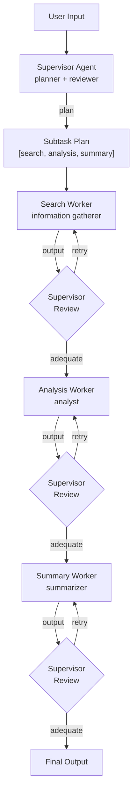

# Supervisor Pattern

A supervisor agent plans subtasks, dispatches them to specialized workers, reviews each worker's output for quality, and retries with feedback if the result is inadequate. Implements a research workflow with search, analysis, and summary workers.

## When to Use

- **Research tasks**: Gather information, analyze it, and produce a summary
- **Quality-critical workflows**: When outputs must meet a quality bar before proceeding
- **Complex queries**: Tasks that benefit from decomposition into smaller subtasks

## Architecture



## How It Works

1. **Supervisor plans**: Given the user's input, the supervisor generates a JSON plan with ordered subtasks, each assigned to a worker
2. **Worker execution**: Each subtask is dispatched to its assigned worker. Workers receive the instruction plus context from previous workers
3. **Quality review**: After each worker completes, the supervisor reviews the output and returns an `adequate` boolean plus feedback
4. **Retry loop**: If output is inadequate, the worker retries with the supervisor's feedback appended to its instructions (up to 3 attempts)
5. **Final output**: The last worker's accepted output becomes the pattern's result

### Event Flow

```
agent_start  {agent: "supervisor", role: "planner"}
chunk        {agent: "supervisor", content: "Plan: search -> analysis -> summary"}
agent_end    {agent: "supervisor", ...}
handoff      {from: "supervisor", to: "search", reason: "Dispatching search task"}
agent_start  {agent: "search", role: "information gatherer"}
chunk        {agent: "search", content: "...findings..."}
agent_end    {agent: "search", ...}
handoff      {from: "search", to: "supervisor", reason: "Reviewing search output"}
agent_start  {agent: "supervisor", role: "reviewer"}
chunk        {agent: "supervisor", content: "Review of search: adequate. ..."}
agent_end    {agent: "supervisor", ...}
handoff      {from: "supervisor", to: "analysis", reason: "Dispatching analysis task"}
...
done         {totalUsage: {...}}
```

## Workers

| Worker | Role | Purpose |
|--------|------|---------|
| `search` | information gatherer | Finds facts, data, and sources |
| `analysis` | analyst | Identifies patterns, compares perspectives, draws insights |
| `summary` | summarizer | Produces clear, comprehensive reports |

## Tradeoffs

- **Quality assurance**: Review loop catches poor outputs before they propagate
- **Adaptive**: Retry with feedback often produces better results on the second attempt
- **Transparent**: Each planning and review step is visible in the trace
- **Higher latency**: Review adds an LLM call after every worker, and retries multiply cost
- **Max 3 iterations**: The retry cap prevents infinite loops but may stop before quality is reached
- **Planning reliability**: The supervisor must produce valid JSON plans; malformed output causes errors
