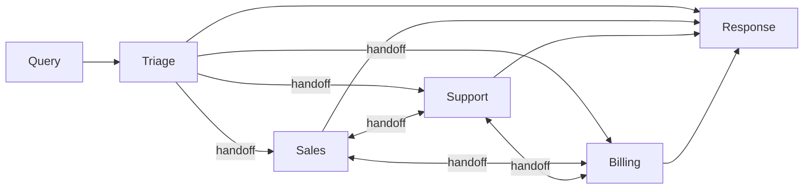

# Swarm Pattern

Dynamic agent-to-agent handoffs without central routing. Each agent decides independently whether to handle a request or pass it to another agent, creating an emergent routing topology.

## When to Use

- **Customer support**: Triage, sales, support, and billing agents self-organize around customer needs
- **Multi-domain workflows**: When the right specialist depends on context discovered during conversation
- **Decentralized routing**: When no single agent has enough context to route upfront

## Architecture



## How It Works

1. Every query starts at the **triage agent**, which analyzes intent
2. If triage can handle it directly (greetings, vague questions), it responds
3. Otherwise, triage includes a `[HANDOFF:target]` directive in its response
4. The runner detects the directive, emits a handoff event, and runs the target agent
5. The target agent can also hand off to another agent if needed
6. The chain continues until an agent responds without a handoff (max 5 iterations)

### How It Differs from Router

| | Router | Swarm |
|---|--------|-------|
| **Routing** | Centralized — one router classifies upfront | Decentralized — each agent decides |
| **Handoff direction** | One-way (router to specialist) | Any-to-any (agents hand off freely) |
| **Chain depth** | Always 2 (router + specialist) | Variable (1 to N agents) |
| **Context** | Specialist only sees original query | Each agent sees prior agent's response |

### Event Flow

```
agent_start  {agent: "triage", role: "triage"}
chunk        {agent: "triage", content: "...I'll connect you..."}
agent_end    {agent: "triage", ...}
handoff      {from: "triage", to: "billing", reason: "triage handed off to billing"}
agent_start  {agent: "billing", role: "specialist"}
chunk        {agent: "billing", content: "...I can help with your invoice..."}
agent_end    {agent: "billing", ...}
done         {totalUsage: {...}}
```

## Agents

| Agent | Role | Purpose |
|-------|------|---------|
| `triage` | triage | Initial contact, analyzes intent, hands off or responds directly |
| `sales` | specialist | Pricing, plans, upgrades, purchasing |
| `support` | specialist | Technical issues, troubleshooting, bugs |
| `billing` | specialist | Invoices, payments, refunds, subscriptions |

## Tradeoffs

- **Flexible routing**: Agents discover the right handler through conversation, not classification
- **Context preservation**: Each agent sees what the previous agent said, enabling warm handoffs
- **Emergent behavior**: New routing paths appear without changing a central router
- **Unpredictable paths**: Harder to guarantee which agent handles a query
- **Handoff loops**: Agents could ping-pong between each other (mitigated by max iteration limit)
- **Higher latency**: Multi-hop chains add round-trips compared to direct routing
